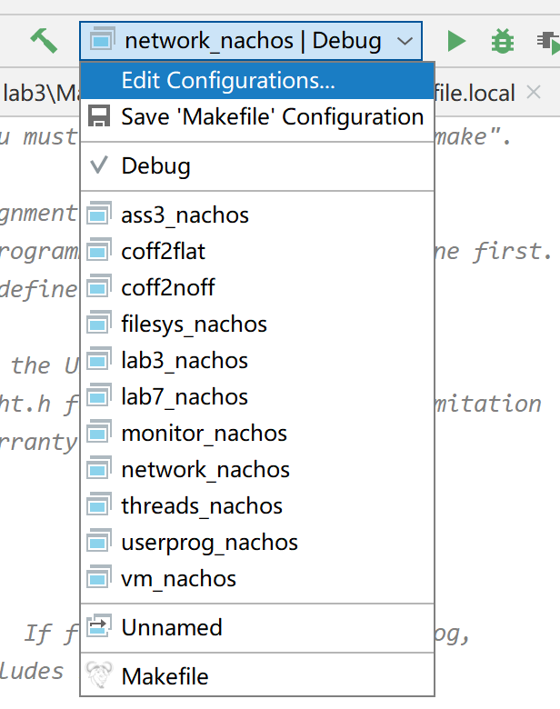

## 真香警告⚠
可调试汇编
## notice
 - change GCCDIR in Makefile.dep to suit your mips-gcc
 - you may need to exec 
```shell  
sudo chmod +x /bin/coff2flat"  
```
 and   
```shell  
sudo chmod +x /bin/coff2noff  
```
when failed to exec make in /test  

遇事不决chmod +x

coff的两个程序被我改成需要cmake才能编译了 不过会有编译好的在那 如果不改源码可以不哟用管

```
coff2noff = ../bin/coff2noff
coff2flat = ../bin/coff2flat
```

## dependency
sudo apt-get install cmake  
sudo dpkg –add-architecture i386  
sudo apt-get install lib32stdc++6  
sudo apt-get install libc6-dev-i386  
sudo apt-get install g++-multilib    
sudo apt-get install build-essential module-assistant   
sudo apt-get install g++  
sudo apt-get install g++-multilib   
sudo apt-get install gcc-multilib   
sudo apt-get install gcc  
如果装完这些还报错 请自行百度如何在64位电脑上运行32位程序  

## 关于cmake 
test文件夹暂时还是需要makefile的(与其说是makefile不如说是执行了一串脚本 改cmake也意义不大)  

直接用clion打开code文件夹  
如果你使用macos/windows 请在Toolchains里配置Remote编译器   

打开项目之后即可选择要构建的目标




## 如何使用

比如基础的threads

内部有cmakeList.txt和threads_core.cmake 你可以把他们类比为makefile和makefile.local

threads_core.cmake包含着基础的cpp路径和include路径

cmakeList.txt内部通过add_executable来构建目标可执行文件


```
include(threads_core.cmake) 引入cpp和头文件
SET(EXECUTABLE_OUTPUT_PATH ${CMAKE_CURRENT_SOURCE_DIR}) 把可执行文件输出到当前目录下
add_executable(threads_nachos ${threadsCPP} main.cc) 添加cpp和main函数 生成的可执行文件为threads_nachos
```

```
FILE(GLOB_RECURSE threadsCPP        将下列文件添加到threadsCPP的变量里
${CMAKE_HOME_DIRECTORY}/threads/switch.s        
${CMAKE_HOME_DIRECTORY}/threads/list.cc        ${CMAKE_HOME_DIRECTORY}/threads/scheduler.cc        ${CMAKE_HOME_DIRECTORY}/threads/synch.cc        ${CMAKE_HOME_DIRECTORY}/threads/synchlist.cc        ${CMAKE_HOME_DIRECTORY}/threads/system.cc        ${CMAKE_HOME_DIRECTORY}/threads/thread.cc        ${CMAKE_HOME_DIRECTORY}/threads/utility.cc        ${CMAKE_HOME_DIRECTORY}/threads/threadtest.cc        ${CMAKE_HOME_DIRECTORY}/threads/synchtest.cc        ${CMAKE_HOME_DIRECTORY}/machine/interrupt.cc        ${CMAKE_HOME_DIRECTORY}/machine/sysdep.cc        
${CMAKE_HOME_DIRECTORY}/machine/stats.cc        
${CMAKE_HOME_DIRECTORY}/machine/timer.cc        )
include_directories(        
${CMAKE_HOME_DIRECTORY}/threads      添加包含目录  
${CMAKE_HOME_DIRECTORY}/machine)
add_definitions(-DTHREADS) 添加宏定义
```

关于make变量定义 由make的ifndef MAKEFILE_FILESYSdefine MAKEFILE_FILESYSyesendef  

迁移到cmake风格的

```
set(MAKEFILE_FILESYS ON)
```

由make的ifdef MAKEFILE_USERPROG_LOCALDEFINES := $(DEFINES:FILESYS_STUB=FILESYS)elseINCPATH += -I../userprog -I../filesysDEFINES += -DFILESYS_NEEDED -DFILESYSendif  

迁移到cmake风格的

```
if(MAKEFILE_USERPROG_LOCAL)
else()
    add_definitions(-DFILESYS_NEEDED -DFILESYS)
endif()
```

有关于

```
DEFINE:= $(DEFINES:FILESYS_STUB=FILESYS)
```

还没有弄懂

### 总cmakelists.txt

在项目目录下有公共list

```cmake
project(nathos) # 项目名称
cmake_minimum_required(VERSION 3.10)#  最低cmake版本
execute_process(COMMAND rm ${CMAKE_CURRENT_SOURCE_DIR}/threads/switch.s)  # 执行两行脚本用来对switch.s进行宏替换预处理 如果修改了switch-linux的源码要特别注意这里有没有执行成功
execute_process(COMMAND sh ${CMAKE_CURRENT_SOURCE_DIR}/build-switch.sh ${CMAKE_CURRENT_SOURCE_DIR})


#添加对.s的编译
ENABLE_LANGUAGE(ASM)
# 32bit编译

#原有的警告
#set(CMAKE_CXX_FLAGS "-m32 -Wall -Wshadow")
set(CMAKE_CXX_FLAGS "-m32")
#set(CMAKE_ASM_FLAGS "-m32 -Wall -Wshadow")
set(CMAKE_ASM_FLAGS "-m32")
add_definitions(-DHOST_i386)
add_definitions(-DHOST_LINUX)
add_definitions(-DCHANGED) # 这三个宏定义贯穿整个项目

# 下面是把每个子项目都包含进来 让clion能索引到
add_subdirectory(threads)
add_subdirectory(ass3)
add_subdirectory(bin)
add_subdirectory(filesys)
add_subdirectory(lab3)
add_subdirectory(lab7-8)
add_subdirectory(monitor)
add_subdirectory(network)
add_subdirectory(userprog)
add_subdirectory(vm)

```


## 原生makefile的开发

使用pip install compiledb 加上插件makefile 可以让clion拥有编译 调试makefile的功能 (不过clion好像必须安装在linux上才可以) 具体详见 https://blog.csdn.net/lylwo317/article/details/86673912

## 进度

threads √

vm √

ass3 √

coff一家 √

filesys 缺函数

monitor √

network 缺函数

userprog √

lab3 缺函数

lab78 √

lab5 没有makefile

test 建议直接make